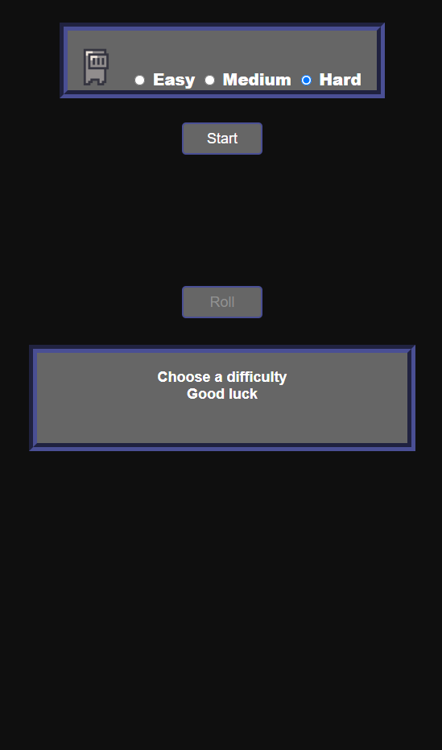

# Dungeon Crawler

A minimalistic dungeon crawler with gameplay inspired by _Dungeons & Dragons_. Choose a difficulty, then face off against an endless horde of monsters. Keep rolling the dice to see how long you can survive!

## Screenshots

    
    

## Technologies Used
HTML, CSS, and Javascript

## Getting Started

[Link to deployed game](https://cjc027.github.io/Project-1/)

Begin by selecting a difficulty, then press the _Start_ button. The difficulty selected will determine your starting stats and items. When you first encounter a monster, you will need to roll for initiative. If your roll is greater or equal to the monster's, you will attack first. Items may only be used on your turn before you roll. Rolling returns a number between 1 and 8, which is added to your strength to determine the damage you deal. Good luck!

## Next Steps
- ~~Give monsters a small chance to drop items~~
- Add additional encounter types (e.g. treasure rooms or rest areas). Add an element of risk-reward by giving the player two options: to roll or to leave. The player can leave with no penalty and move on to the next encounter. If the player chooses to roll, they must roll above a certain value in order to avoid a negative outcome (e.g. a trap or an ambush)

- 

    
Long-term goals (<b>Click to expand</b>)

    <ul>
    <li>
    Implement more stat types (e.g. dexterity) that can augment the player's dice roll in room encounters (in the same way that the strength stat augments player damage)
    </li>
    <li>
    Using these new stats, assign monsters resistance or weakness to certain stats. Instead of strength, use the player's highest stat to augment damage. If the player rolls successfully in a treasure room encounter, they will be presented with 3 items to choose from. In this way, the player can make more meaningful choices about the type of character they want to build
    </li>
    </ul>

## Attributions
[Dice Roll SFX](https://freesound.org/people/nettimato/sounds/353974/) by nettimato [CC0 1.0](https://creativecommons.org/publicdomain/zero/1.0/) 
[Dungeon Ambiance](https://freesound.org/people/phlair/sounds/388340/?page=1#comment) by Phlair [CC BY 3.0](https://creativecommons.org/licenses/by/3.0/) 
[Dungeon Sprites](https://analogstudios.itch.io/dungeonsprites) by analogStudios [CC0 1.0](https://creativecommons.org/publicdomain/zero/1.0/) 
[Potion SFX](https://freesound.org/people/ValentinPetiteau/sounds/574077/) by ValentinPetiteau [CC0 1.0](https://creativecommons.org/publicdomain/zero/1.0/) 
[Smoke Poof SFX](https://freesound.org/people/Saviraz/sounds/512217/) by Saviraz [CC0 1.0](https://creativecommons.org/publicdomain/zero/1.0/) 