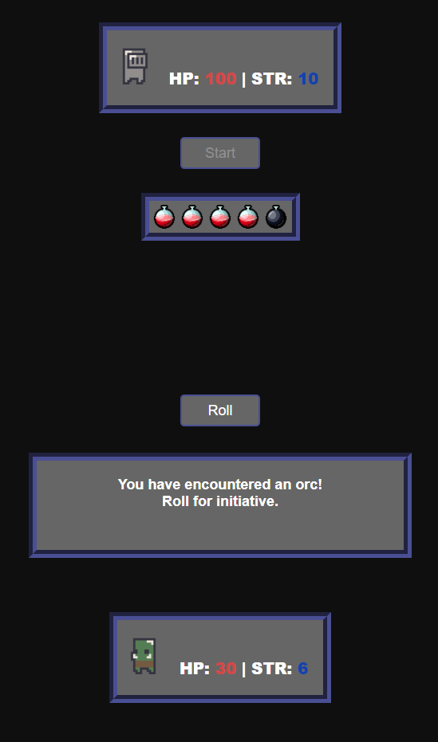

# Dungeon Crawler

A minimalistic dungeon crawler with gameplay mechanics inspired by _Dungeons & Dragons_. Choose a difficulty, then face off against an endless horde of monsters. Keep rolling the dice to see how long you can survive!

## Screenshots

    
    

## Technologies Used
HTML, CSS, and Javascript

## Getting Started

(Placeholder - Link to game)

Begin by selecting a difficulty, then press the _Start_ button. The difficulty selected will determine your starting hitpoints and strength. When you first encounter a monster, you will need to roll for initiative. If your roll is greater or equal to the monster's, you will attack first. Rolling returns a number between 1 and 8, which is added to your strength to determine the damage you deal. Good luck!

## Next Steps
- Give the player a set of starting items depending on the difficulty selected
- Give monsters a chance to drop items
- Instead of only encountering monsters, add in additional encounters (e.g. treasure rooms or rest areas). Add an element of risk-reward by giving the player two options: to roll or to leave. The player can leave with no penalty and move on to the next encounter. If the player chooses to roll, they must roll above a certain value in order to avoid a negative outcome (e.g. a trap or an ambush).

## Attributions
[Roll SFX](https://freesound.org/people/nettimato/sounds/353974/) by nettimato  
[Dungeon Ambiance](https://freesound.org/people/phlair/sounds/388340/?page=1#comment) by Phlair 
[Dungeon Sprites](https://analogstudios.itch.io/dungeonsprites) by analogStudios 
Defeat SFX from *__Dark Souls__*, developed by FromSoftware and published by Bandai Namco Games 